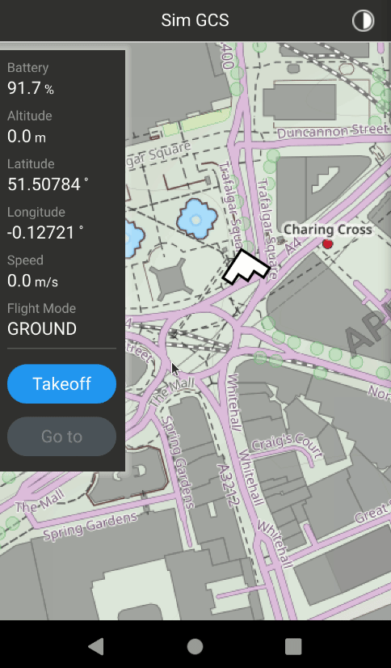
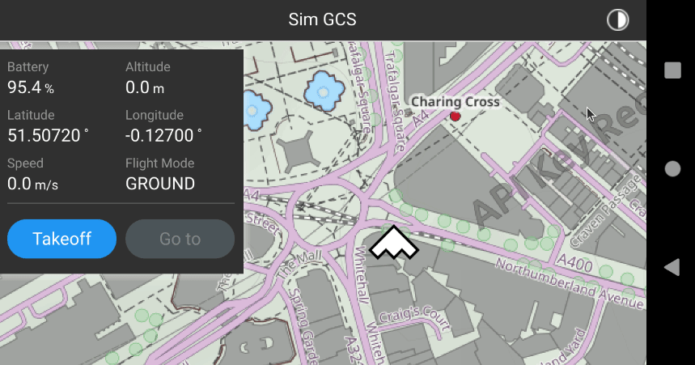

# Sim GCS
This is my submission for the take-home coding exercise given by Firestorm Labs when applying for a GUI Software Engineer position May 2024. The instructions I was assigned can be found in [instructions.pdf](instructions.pdf)

## First Look

The App can run on both Android Emulator and Ubuntu 22. The App allows one to control a simulated UAS vehicle (launch, select and move to a GoTo coordinate, land). 

##### Example of doing a flight cycle with the app (launch, GoTo, land)


As an extra the app also supports Light/Dark mode and landscape layouts.



## System Setup

I used a Ubuntu 22.04 machine as my dev environemnt (no Docker container). To setup my system I followed the instructions Qt provides at https://doc.qt.io/qt-6/android-getting-started.html. The following are some notes about how I setup the system (instructions on website are a bit old and needed adjusting for my own system)

##### Apt installs
Run the following

```
sudo apt update
sudo apt upgrade -y

# note: version of openjdk seems picky. v11 and v21 didn't work, but v17 did
sudo apt install -y libxcb-cursor0 git vim libxcb-xinerama0 libstdc++6:i386 libgcc1:i386 zlib1g:i386 libncurses5:i386 build-essential libgl1-mesa-dev openjdk-17-jdk
```

##### Install Qt 5.15.17
Use the latest Qt-Online-installer to get Qt 5.15.17. Install Qt Creator along with the Android and GCC libraries.

##### Install Android SDK/NDK

Follow the instuction given in this [video](https://doc.qt.io/qt-6/android-getting-started.html) to install the Android SDK using the Qt Creator GUI. Here are some notes to help along if you have troubles.

    a difference from the video: 
    - after clicking the "SDK manager Button", select the following in addition to what the video saye
        - Android 12.0 ("S")
            - sdk manager
            - google play intel x86_64 atom system image
- 
    After installing Android SDK to the default ~/Android/SDK 
    location, my SDK folder install had the following:

    sdk version 13
    - "platforms;android-31"
    - "build-tools;31.0.0"
    - "ndk;25.1.8937393"
    - "ndk;22.1.7171670"
    - "system-images;android-31;google_apis;x86_64"

    Use the x86_64 ABI in all places 

    Edit -> Preferences -> Devices -> Add
      - name "AndroidEmulator"
      - "Phone" "Galaxy Nexus"
      - "x86_64"
      - android 31
    Also make sure your build step is using x86_64
      - project -> build step -> details -> ABIs -> x86_64

## Run Using QtCreator and Android Emulator

Open Qt Creator and select `File` -> `Open File of Project` -> `CMakeLists.txt` (one at root of this repo)

Next to the big play button select `Android` -> `simGCS` (sometimes it selects `""` instead of `"simGCS"` on first start)

Run using the Play button (not the Debug play button, i didn't do the setup to get that working)
* Note: Android is built with the Debug Cmake configuration to avoid having to deal with apk signing (Release config requires that), but the debug play button does not work, only the non-debug play button.

## Run Linux app and Linux Unit tests

The Linux targets can similarly be run using the play button in Qt Creator

## Things completed

I did all the requirements, with the exception of return-to-home, which i missed when reading the instruction docs (return-to-home is mentioned once at the beginning of the instructions but then later it only lists `launch`, `GoTo`, and `land` as requirements).

## Bonus Points

The 2 extras I did were 
1. make a Git repo
2. make things extra pretty (app has a focus on following Google Material Design)

## Future Development

It would be awesome to get automated builds working in a CI/CD setup and get a deployment on the Google Play store.